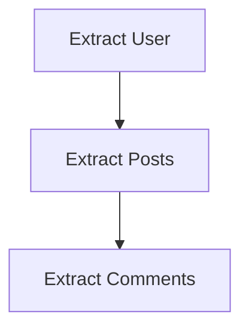

# @wpkernel/pipeline <-> Architecture Guide

## The Philosophy

The pipeline is designed as a **Directed Acyclic Graph (DAG) Execution Engine**. Its primary goal is to take a set of "Helpers"—which can be anything from simple functions to complex services - sort them based on their dependencies, and execute them in a deterministic order.

It is **NOT** opinionated about what your helpers do. It does **NOT** enforce a specific "Fragment/Builder" pattern, though that is a common use case.

## Internal Structure

The codebase is organized into two primary modules to separate concerns:

1.  **Core (`src/core/runner`)**: Contains the pure DAG runner, dependency resolution logic (`src/core/dependency-graph.ts`), and extension orchestration (`src/core/extensions`). It knows nothing about "Fragments" or "Builders" - only generic "Helpers" and "Stages".
2.  **Standard Pipeline (`src/standard-pipeline`)**: Implements the specific "Fragment → Builder" pattern used by WPKernel CLI. It consumes `core` primitives to build the standard execution program (via `createPipeline`).

## Core Concepts

### 1. Helpers & Kinds

A `Helper` is an atomic unit of work identified by a `key`. Every helper belongs to a `kind` (e.g., `'extract'`, `'transform'`, `'render'`).
helpers declare their dependencies using `dependsOn`. The runner builds a separate dependency graph for _each_ kind.

### 2. Stages

A `Stage` defines _when_ a set of helpers executes. You define the sequence of stages in your pipeline.
For example, an ETL pipeline might have three stages corresponding to three helper kinds:

- **Independent execution**: Each stage executes its registered helpers topologically.
- **Shared Context**: Stages share a mutable `context` and can pass data via "Drafts" or "Artifacts".
- **Output composition**: A helper can return a replacement output for the next helper. Advanced helpers can call `next(output?)` to wrap the remaining chain and post-process its returned output.

#### Public custom-stage boundary

`makePipeline` supplies `createStages` with the root-exported
`PipelineStageDependencies` facade. It deliberately exposes only stable,
domain-neutral capabilities: typed helper/lifecycle/finalization stages,
explicit commit, halt/pause, diagnostic recording, and lifecycle metadata.

`PipelineStageState` carries typed run options, context, reporter, user state,
diagnostics, steps, and helper execution snapshots. A custom stage replaces
user state immutably by returning `{ ...state, userState: replacement }`.
`PipelineStageResult` restricts returns to the next state, a process-local
pause, or `PipelineHalt`.

Helper stages use `PipelineHelperStageOptions`, whose `makeArgs`,
`writeOutput`, registration metadata, rollback entries, and final output retain
their consumer-declared types. The internal `AgnosticStageDeps` and mutable
runner state are not public extension points.

The package root exports every supported custom-stage type. External
declarations should therefore reference `@wpkernel/pipeline`, never
`@wpkernel/pipeline/core/runner/*`.

#### Diagnostic ownership

Registration diagnostics belong to the configured pipeline instance. At the
start of each invocation, pipeline copies them into a new run-owned diagnostic
collection; runtime diagnostics and the reporter then remain isolated to that
invocation. The same collection travels with a process-local pause snapshot
and resume, so a paused result includes both registration and runtime
diagnostics without sharing mutable diagnostic state with concurrent runs.

#### Process-local suspension boundary

The public API retains `pause` and `resume` for compatibility. A
`PipelinePauseSnapshot` is deliberately process-local: its state contains live
runner objects, including maps, sets, diagnostic managers, extension
coordinators, and rollback callbacks. It is not a serializable or portable
checkpoint and must be resumed by the same pipeline implementation in the same
process.

Consumers own durable checkpoint concerns such as serialization, storage,
transport, version binding, plan identity, approval state, and migrations.
`llm-core`, for example, must translate its own durable representation into a
new pipeline invocation rather than persist pipeline suspension state.

### 3. Extensions & Lifecycles

Extensions wrap the execution flow. Custom pipelines can attach hooks to
arbitrary lifecycle names. The standard pipeline begins extension execution
after fragment finalisation so every hook receives the declared artifact type.
This allows for cross-cutting concerns:

- **Transactions**: Prepare resources during extension registration, then
  commit or roll them back through lifecycle hook results.
- **Logging**: Log start/end times.
- **Resource Management**: Connect/Disconnect databases.

## The "Standard" Model (WPKernel CLI)

While generic, WPKernel's main use case (code generation) uses a specific configuration:

1.  **Phase 1: Fragments (`kind: 'fragment'`)**
    - Helpers generate partial ASTs or code snippets.
    - They write to a shared "Draft" (e.g., a list of PHP blocks).
    - Executed by `makeLifecycleStage` (internal primitive).

2.  **Phase 2: Builders (`kind: 'builder'`)**
    - Helpers take the finalized "Artifact" (merged fragments) and write files to disk.
    - Executed by `makeLifecycleStage` (internal primitive).

3.  **Extensions**
    - Manage file system writes (committing files only if generation succeeds).

## Building Custom Architectures

You can build entirely different architectures using `makePipeline`:

- **Serial Pipelines**: A single stage with one helper kind.
- **Micro-Frontends**: Resolution stages for different UI widgets.
- **Data Migrations**: Versioned migration helpers with rollback guarantees.

The generic runner ensures:

- **Cycle Detection**: `A -> B -> A` halts execution (fails fast).
- **Missing Dependencies**: `A` depends on `C` (which doesn't exist) throws an error.
- **Best-Effort Rollback**: If _any_ stage throws, the pipeline halts and executes the rollback chain for all extensions and helpers.
    > **Note**: Rollbacks attempt to revert completed steps but are not guaranteed to be fully atomic (e.g. if a network call in a rollback fails). They may leave partial effects. Design compensating actions to be idempotent.
